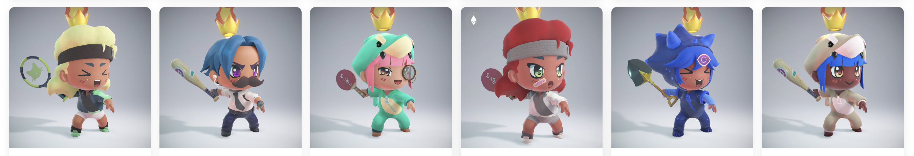
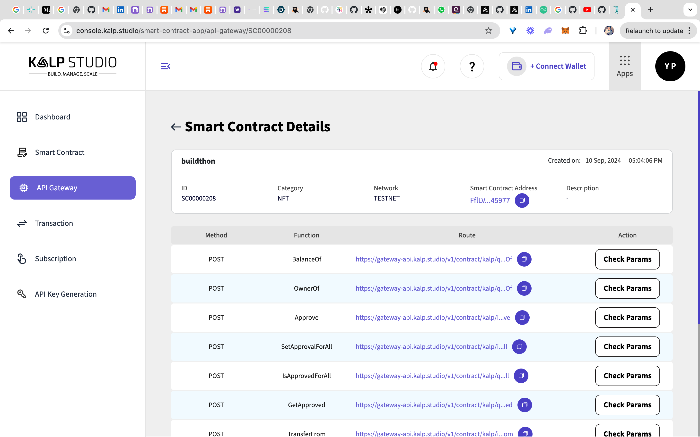
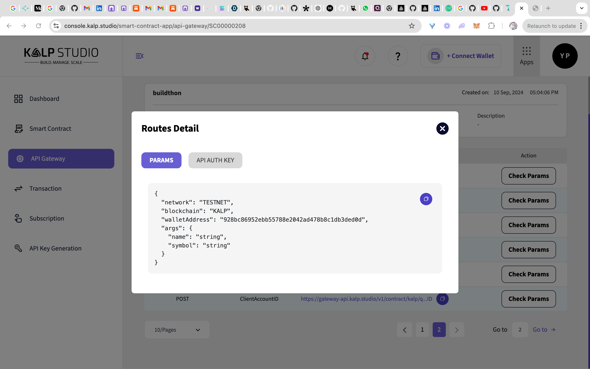
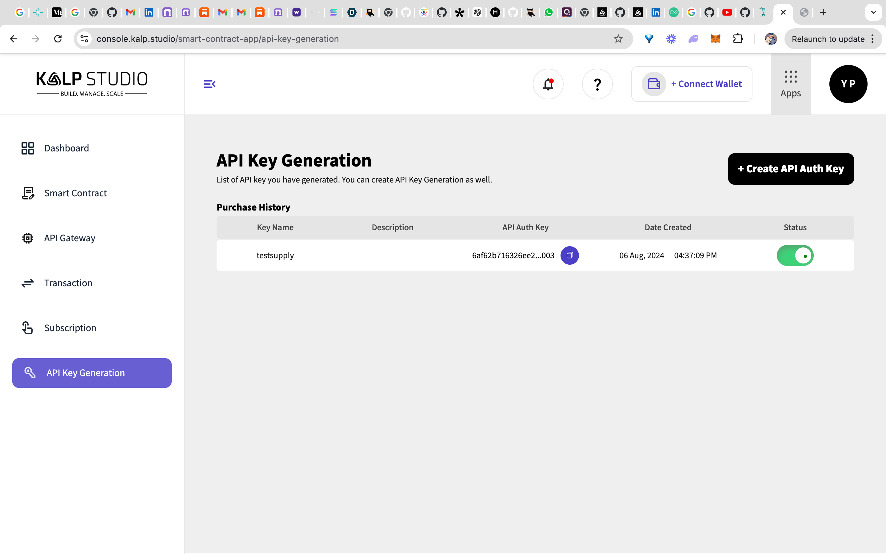
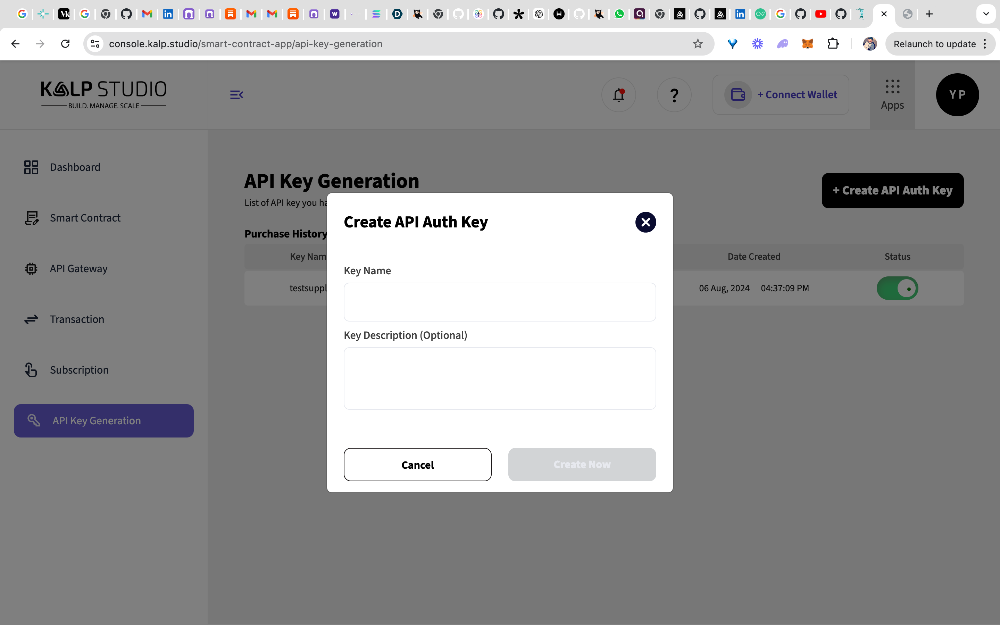
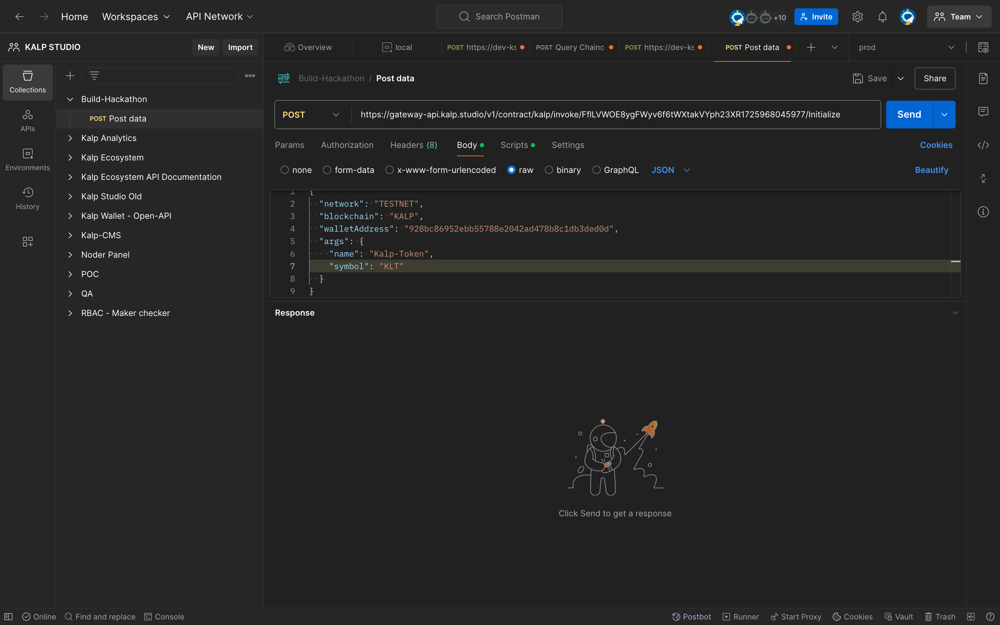
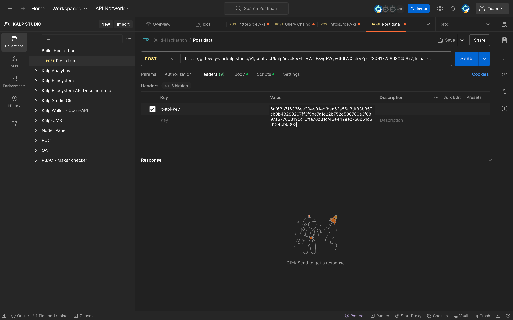
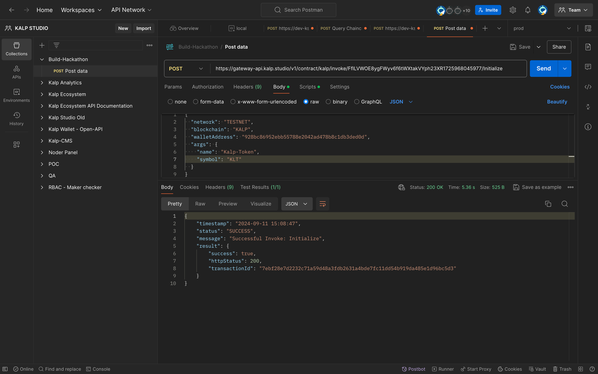
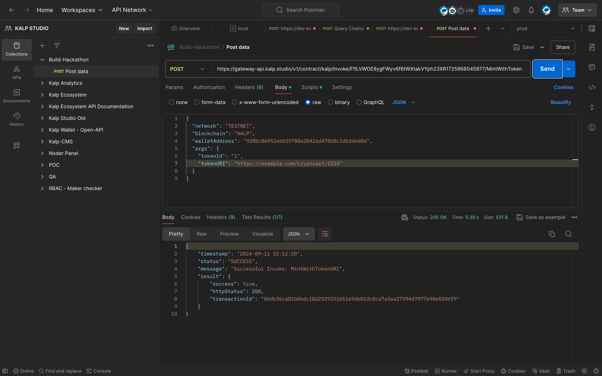
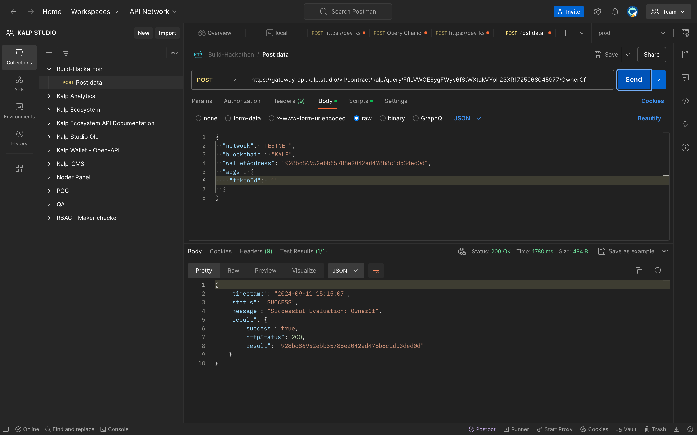

**(Challenge-2): Sophomore**
# 🚀 Build Your Own NFT System on the Kalp Blockchain


## What is this challenge about?

This challenge is about developing a Non-Fungible Token (NFT) system using the KRC-721 standard on the Kalp blockchain. We will create a smart contract in Go that handles the lifecycle of NFTs, including minting, transferring, and burning tokens. The challenge simulates real-world scenarios where NFTs are used for digital art, collectibles, and other unique assets.

## What will we learn?

**By participating in this challenge, we will:**

- Gain hands-on experience with the Go programming language.
- Understand the KRC-721 standard for NFTs.
- Learn how to develop and deploy smart contracts on the Kalp blockchain.
- Enhance our skills in blockchain development and decentralized applications (dApps).
- Explore the concepts of tokenization and digital asset management.
- Improve our problem-solving and coding abilities in a competitive environment.

---

## Ready to Get Started?

### Let's understand the KRC-721 first!

Imagine you're playing your favorite online game. You've just unlocked an epic sword that's one-of-a-kind. No one else in the game has this exact sword, and it's got special stats that make it super powerful. Now, wouldn't it be awesome if you could prove that this sword is truly yours, trade it with other players, or even sell it outside the game? That's where KRC-721 comes in.

**KRC-721** is a set of rules (or a standard) on the Kalp blockchain that allows developers to create unique digital items, just like that epic sword. These digital items are called Non-Fungible Tokens (NFTs). Unlike regular game currency or items (which are usually identical and can be swapped 1:1), NFTs are unique. Each one has its own identity and characteristics, making them more like collectibles than regular in-game items.



---

## Checkpoint 0: 📦 Installation

Before you begin, ensure you have the following:

### Step 1. 🖥 [Download Go](https://go.dev/doc/install)

> **Note:** Ensure you have Go version `>=1.19` but `<1.20` in the [Go.mod file](https://github.com/PrabalParihar/BuildThon/blob/main/go.mod#L3)

---

**To start the project, follow these steps:**

1. **Clone the repository:**

   ```sh
   git clone https://github.com/Build-Hackathon/sophomore.git
   ```

2. **Navigate to the project directory:**

   ```sh
   cd sophomore
   ```

3. **Install the dependencies:**

   ```sh
   go mod tidy
   ```

---

After executing the above commands, the folder structure should look like this:

```
sophomore
├── vendor
├── go.mod
├── go.sum
├── krc
├── main.go
└── krc.go  (Your NFT contract file)
```

---

## Checkpoint 1: 🏗 NFT Contract Walkthrough

Let's **open the file `krc.go`** and dive deep into the NFT contract.

> 💡 Refer to the docs for more detailed info: [Write the Smart Contract](https://docs.kalp.studio/Dev-documentation/Kalp-DLT/Smart-Contract-Write-Test-Deploy-Interact/Write-the-smart-contract/)

### 1. Initializing the Token Contract

The **Initialize** method is the first step in setting up your Kalp-based ERC721 token contract. This method assigns a name and symbol to the token collection, ensuring that these identifiers are consistently used throughout the token's lifecycle.

```go
func (c *TokenERC721Contract) Initialize(ctx kalpsdk.TransactionContextInterface, name string, symbol string) (bool, error) {
    err := ctx.PutStateWithoutKYC(nameKey, []byte(name))
    if err != nil {
        return false, fmt.Errorf("failed to set token name: %v", err)
    }
    err = ctx.PutStateWithoutKYC(symbolKey, []byte(symbol))
    if err != nil {
        return false, fmt.Errorf("failed to set token symbol: %v", err)
    }
    return true, nil
}
```

- **Parameters:**

  - `name (string)`: The human-readable name that designates the token collection, often aligning with its intended use cases or branding.

  - `symbol (string)`: A concise and recognizable symbol that serves as a shorthand identifier for the token collection, typically following conventional naming conventions (e.g., "MTK" or "KALP").

- **Return Values:**

  - `(bool, error)`: A boolean indicating success or failure, and an error object if any issues arise.

### 2. 🖨 Minting NFTs

The **MintWithTokenURI** method allows you to create new NFTs in the Kalp ecosystem. This method is crucial for establishing ownership and linking the NFT to its metadata.

```go
func (c *TokenERC721Contract) MintWithTokenURI(ctx kalpsdk.TransactionContextInterface, tokenId string, tokenURI string) (*Nft, error) {
    nft := &Nft{TokenId: tokenId, Owner: /* Owner's identity */, TokenURI: tokenURI}
    nftKey, _ := ctx.CreateCompositeKey(nftPrefix, []string{tokenId})
    nftBytes, _ := json.Marshal(nft)
    ctx.PutStateWithoutKYC(nftKey, nftBytes)
    return nft, nil
}
```

- **Parameters:**

  - `tokenId (string)`: The unique identifier for the NFT.

  - `tokenURI (string)`: A URI pointing to a JSON file with the NFT's metadata.

    **Example JSON Format to store in URI:**

    ```json
    {
      "name": "CryptoArt #1234",
      "description": "A unique piece of digital art from the CryptoArt collection.",
      "image": "https://example.com/images/cryptoart-1234.png",
      "attributes": [
        {
          "trait_type": "Background",
          "value": "Blue"
        },
        {
          "trait_type": "Eyes",
          "value": "Green"
        },
        {
          "trait_type": "Mouth",
          "value": "Smile"
        },
        {
          "trait_type": "Accessory",
          "value": "Sunglasses"
        }
      ],
      "external_url": "https://example.com/cryptoart/1234"
    }
    ```

- **Return Values:**

  - `(*Nft, error)`: A pointer to the newly created NFT object and an error object if any issues occur.

### 3. 🔥 Burning NFTs

The **Burn** method is used to permanently remove an NFT from the Kalp ecosystem, effectively destroying the token and revoking its ownership.

```go
func (c *TokenERC721Contract) Burn(ctx kalpsdk.TransactionContextInterface, tokenId string) (bool, error) {
    nftKey, _ := ctx.CreateCompositeKey(nftPrefix, []string{tokenId})
    ctx.DelStateWithoutKYC(nftKey)
    return true, nil
}
```

- **Parameters:**

  - `tokenId (string)`: The unique identifier that pinpoints the specific NFT destined for elimination.

- **Return Values:**

  - `(bool, error)`: A boolean indicating success or failure, and an error object if any issues arise during the burning process.

### 4. 🔄 Transferring NFTs

The **TransferFrom** method facilitates the transfer of an NFT from one owner to another within the Kalp ecosystem, ensuring a secure and verified transaction.

```go
func (c *TokenERC721Contract) TransferFrom(ctx kalpsdk.TransactionContextInterface, from string, to string, tokenId string) (bool, error) {
    nft, _ := _readNFT(ctx, tokenId)
    nft.Owner = to
    nftKey, _ := ctx.CreateCompositeKey(nftPrefix, []string{tokenId})
    nftBytes, _ := json.Marshal(nft)
    ctx.PutStateWithoutKYC(nftKey, nftBytes)
    return true, nil
}
```

- **Parameters:**

  - `from (string)`: The current owner of the NFT, relinquishing their control.

  - `to (string)`: The designated recipient who will assume ownership of the NFT.

  - `tokenId (string)`: The unique identifier that unequivocally designates the specific NFT being transferred.

- **Return Values:**

  - `(bool, error)`: A boolean indicating success or failure, and an error object if any issues arise during the transfer process.

### 5. ✏️ Approval & Authorization

#### a). Approve

The **Approve** method allows an NFT owner to grant another account the authority to transfer a specific NFT on their behalf.

```go
func (c *TokenERC721Contract) Approve(ctx kalpsdk.TransactionContextInterface, operator string, tokenId string) (bool, error) {
    nft, _ := _readNFT(ctx, tokenId)
    nft.Approved = operator
    nftKey, _ := ctx.CreateCompositeKey(nftPrefix, []string{tokenId})
    nftBytes, _ := json.Marshal(nft)
    ctx.PutStateWithoutKYC(nftKey, nftBytes)
    return true, nil
}
```

- **Parameters:**

  - `operator (string)`: The account designated to receive transfer approval for the specified NFT.

  - `tokenId (string)`: The unique identifier that pinpoints the NFT for which authorization is being granted.

- **Return Values:**

  - `(bool, error)`: A boolean indicating success or failure, and an error object if any issues arise during the approval process.

#### b). SetApprovalForAll

The **SetApprovalForAll** method enables an NFT owner to grant an account the ability to manage all of their NFTs, making it easier to handle large collections.

```go
func (c *TokenERC721Contract) SetApprovalForAll(ctx kalpsdk.TransactionContextInterface, operator string, approved bool) (bool, error) {
    sender := /* Fetch sender's identity */
    approvalKey, _ := ctx.CreateCompositeKey(approvalPrefix, []string{sender, operator})
    approval := Approval{Owner: sender, Operator: operator, Approved: approved}
    approvalBytes, _ := json.Marshal(approval)
    ctx.PutStateWithoutKYC(approvalKey, approvalBytes)
    return true, nil
}
```

- **Parameters:**

  - `operator (string)`: The account designated to receive approval for managing all the caller's NFTs.

  - `approved (bool)`: A flag indicating whether to grant (`true`) or revoke (`false`) approval for the operator.

- **Return Values:**

  - `(bool, error)`: A boolean indicating success or failure, and an error object if any issues arise during the approval process.

### 6. 📊 Reading Functions

#### a). BalanceOf

The **BalanceOf** method provides the number of NFTs owned by a specific account, helping you track ownership.

```go
func (c *TokenERC721Contract) BalanceOf(ctx kalpsdk.TransactionContextInterface, owner string) int {
    iterator, _ := ctx.GetStateByPartialCompositeKey(balancePrefix, []string{owner})
    balance := 0
    for iterator.HasNext() {
        iterator.Next()
        balance++
    }
    return balance
}
```

- **Parameters:**

  - `owner (string)`: The account whose NFT holdings are being queried.

- **Return Value:**

  - `(int)`: An integer representing the total number of NFTs owned by the account.

#### b). OwnerOf

The **OwnerOf** method returns the current owner of a specific NFT, confirming ownership.

```go
func (c *TokenERC721Contract) OwnerOf(ctx kalpsdk.TransactionContextInterface, tokenId string) (string, error) {
    nft, err := _readNFT(ctx, tokenId)
    if err != nil {
        return "", err
    }
    return nft.Owner, nil
}
```

- **Parameters:**

  - `tokenId (string)`: The unique identifier of the NFT.

- **Return Values:**

  - `(string, error)`: The owner's account as a string, and an error object if any issues occur.

### 7. 🏗 Read Contract Metadata

#### a). Name

The **Name** method retrieves the name of the token collection, aiding in its identification and reference.

```go
func (c *TokenERC721Contract) Name(ctx kalpsdk.TransactionContextInterface) (string, error) {
    bytes, err := ctx.GetState(nameKey)
    if err != nil {
        return "", err
    }
    return string(bytes), nil
}
```

- **Return Values:**

  - `(string, error)`: The name of the token collection as a string, and an error object if any issues occur.

#### b). Symbol

The **Symbol** method fetches the symbol of the token collection, which serves as a concise identifier.

```go
func (c *TokenERC721Contract) Symbol(ctx kalpsdk.TransactionContextInterface) (string, error) {
    bytes, err := ctx.GetState(symbolKey)
    if err != nil {
        return "", err
    }
    return string(bytes), nil
}
```

- **Return Values:**

  - `(string, error)`: The symbol as a string, and an error object if any issues occur.

---

## Checkpoint 2: 📀 Deploy Smart Contract

Now, it's time to deploy the contract.

Before you begin, ensure you have an account on the [Kalp Studio Platform](https://console.kalp.studio). You can create an account by following the documentation:

1. [Sign Up and Log In to Kalp Studio Platform](https://doc.kalp.studio/Getting-started/Onboarding/How-to-Sign-Up-and-Log-In-to-Kalp-Studio-Platform/)

After creating an account on Kalp Studio Platform, we can deploy the contract using Kalp Studio.

> 💡 Make sure you are connected to [Kalp Studio Wallet (guide)](https://docs.kalp.studio/Getting-started/Kalp-studio-wallet/How-to-Navigate-To-kalp-studio-Wallet/)

2. [Deploy a Smart Contract on KALP Studio (detailed guide)](https://doc.kalp.studio/Dev-documentation/Kalp-DLT/Smart-Contract-Write-Test-Deploy-Interact/Deploy-the-smart-contract/)

   - **Step 1:** Access the Kalp Studio Dashboard.
   - **Step 2:** Go to Kalp Instant Deployer.
   - **Step 3:** Click on "Create New" Smart Contract.
   - **Step 4:** Enter the details:
     - **Name:** Enter a name for your smart contract.
     - **Category:** Choose a category for your smart contract.
     - **Description:** Optionally, you can add a description for your smart contract.
   - **Step 5:** Upload your 'sophomore.zip' file.

> 💡 For a more descriptive deployment guide, please refer to the [detailed docs](https://doc.kalp.studio/Dev-documentation/Kalp-DLT/Smart-Contract-Write-Test-Deploy-Interact/Deploy-the-smart-contract/)

---

## Checkpoint 3: 🕹️ Interact with Smart Contract

Now that we've deployed our NFT smart contract on the Kalp blockchain, it's time to interact with it. We'll perform the following actions:

#### 1. **Initialize Contract**

The `initialize` function sets up your NFT contract by assigning a name and symbol to your token collection.
#### 2. **Token Minting**

The `MintWithTokenURI` function allows you to create a new NFT by assigning a unique `tokenId` and associating it with metadata via a `tokenURI`.
#### 3. **Read the Name of NFT**

You can retrieve the name of your NFT collection using the `Name` function.
#### 4. **Burn**

The `Burn` function allows you to permanently remove an NFT from the blockchain.

To interact with the smart contract, we'll use Postman to send HTTP requests to the API endpoints generated by Kalp Studio after deployment.

### Prerequisites

Before proceeding, ensure you have the following:

1. **[Download Postman](https://www.postman.com/downloads/)**
2. **API Endpoint and API Key**: Obtained from the Kalp Studio after deploying your smart contract.
3. **Smart Contract Functions and Parameters**: Access to the routes and parameters for your smart contract functions, available under **Check Params** in Kalp Studio.

> 💡 For a more descriptive deployment guide, please refer to the [Interacting with Smart Contract](https://doc.kalp.studio/Dev-documentation/Kalp-DLT/Smart-Contract-Write-Test-Deploy-Interact/Interacting-with-smart-contract/)

---

### Tips for Using Postman with Kalp Studio APIs

- **Ensure Correct HTTP Methods:** Pay attention to whether the API endpoint requires a GET or POST request.
- **Authentication:** Always include the `x-api` header with your API Key for authentication.
- **Content-Type Header:** When sending JSON data in the body, ensure the `Content-Type` header is set to `application/json`. Postman usually sets this automatically when you select **raw** and **JSON** in the Body tab.
- **Error Handling:** If you receive an error, check the response message for details. Common issues include missing parameters or invalid authentication.

---

> 💡 **Note:** Always keep your API Key secure. Do not share it publicly or commit it to version control systems.

If you encounter any issues or need more detailed explanations, refer to the [Kalp Studio Documentation](https://doc.kalp.studio) or seek support from the Kalp community.

---

## Example: 🔒 Interact with Smart Contract Using Postman

### Prerequisites

1. **After executing the above setup**
2. **[Sign Up and Log In to Kalp Studio Platform](https://doc.kalp.studio/Getting-started/Onboarding/How-to-Sign-Up-and-Log-In-to-Kalp-Studio-Platform/)**
3. **[Deploy a Smart Contract on KALP Studio](https://doc.kalp.studio/Dev-documentation/Kalp-DLT/Smart-Contract-Write-Test-Deploy-Interact/Deploy-the-smart-contract/)**
4. **[Download Postman](https://www.postman.com/downloads/)**

---

After deploying the smart contract in Kalp Studio, an API endpoint will be generated. This API endpoint can be used to interact with the deployed smart contract.

**Here is an example of a generated API endpoint route in Kalp Studio:**



---

**Click on **Check Params**, and the routing details and parameters should look like this:**



---

An API key is required for authorization in API POST requests.

**It looks like this in Kalp Studio:**



---

**Follow the process for API auth key generation:**



---

### Using the `initialize` Function with Postman

This example demonstrates how to use the `initialize` function and make a POST request using Postman.

#### Instructions

1. **Copy the route of the `initialize` function** and paste it into the URL box in Postman.

2. **Copy the parameters** (Check Params) of the `initialize` function and paste them into the body of Postman, selecting the `raw` JSON type.

3. **Provide custom values** for the `name` and `symbol` of the NFT in the parameters.

   - **Parameters:**

     - `name`: The custom value for the name of the NFT.
     - `symbol`: The custom value for the symbol of the NFT.

   **Example Screenshot:**

   

---

#### Setting Headers in Postman

Set the required headers for authentication:

1. **Key:** `x-api`
2. **Value:** Paste the auth key you obtained after API key generation in Kalp Studio.

**Example Screenshot:**



---

### Sending the POST Request in Postman

1. **Select the request method as POST.**

2. **Click on the Send button** to send the request.

**Example Response:**

You will receive a response in the body below, indicating the result of the initialization.

- **Response Parameters:**

  - `success`: A boolean value indicating the success of the initialization.
  - `message`: A string containing the success message.
  - `transactionid`: The ID of the transaction.

**Example Screenshot:**



---

### Using the `tokenURI` Function with Postman

This example demonstrates how to use the `tokenURI` function and make a GET request using Postman.

#### Instructions

1. **Copy the route of the `tokenURI` function** and paste it into the URL box in Postman.

2. **Copy the parameters** (Check Params) of the `tokenURI` function and paste them into the URL parameters section in Postman.

3. **Provide a custom value** for the `tokenId` in the parameters.

   - **Parameters:**

     - `tokenId`: The custom value for the ID of the NFT.

**Example Screenshot:**



---

### Using the `ownerOf` Function with Postman

This example demonstrates how to use the `ownerOf` function and make a GET request using Postman.

#### Instructions

1. **Copy the route of the `ownerOf` function** and paste it into the URL box in Postman.

2. **Copy the parameters** (Check Params) of the `ownerOf` function and paste them into the URL parameters section in Postman.

3. **Provide a custom value** for the `tokenId` in the parameters.

   - **Parameters:**

     - `tokenId`: The custom value for the ID of the NFT.

**Example Screenshot:**



---

This README serves as an overview for developing and deploying KRC-721 NFTs using Go on the Kalp blockchain. For additional details, refer to the Kalp SDK documentation.

---
